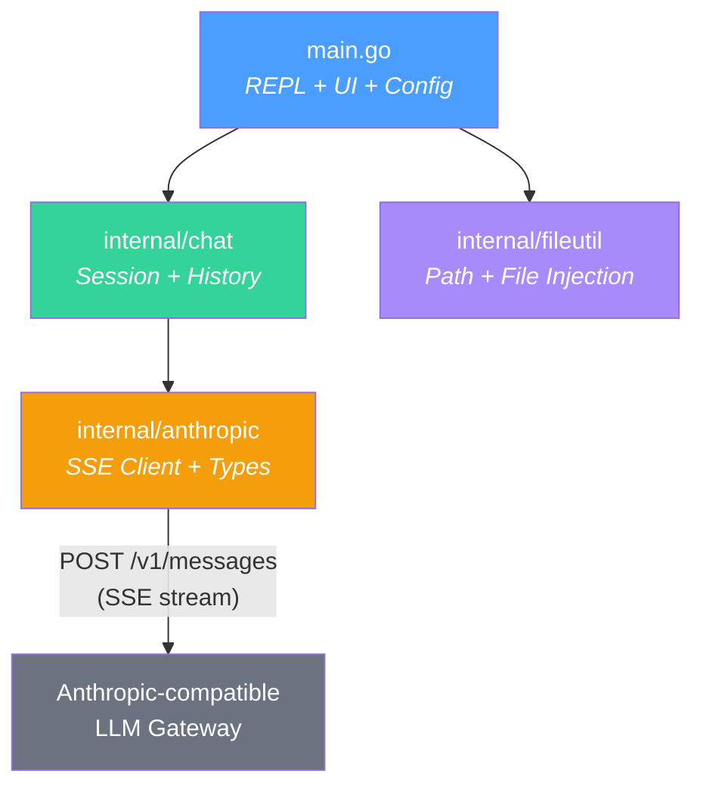
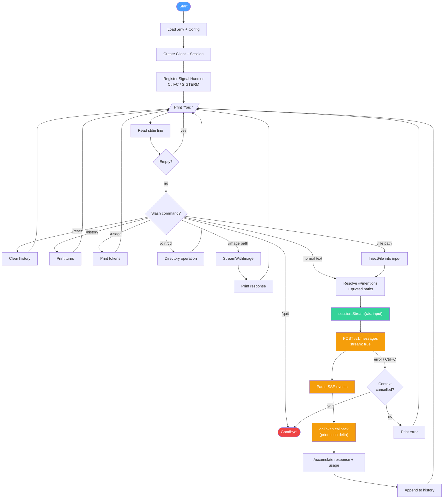
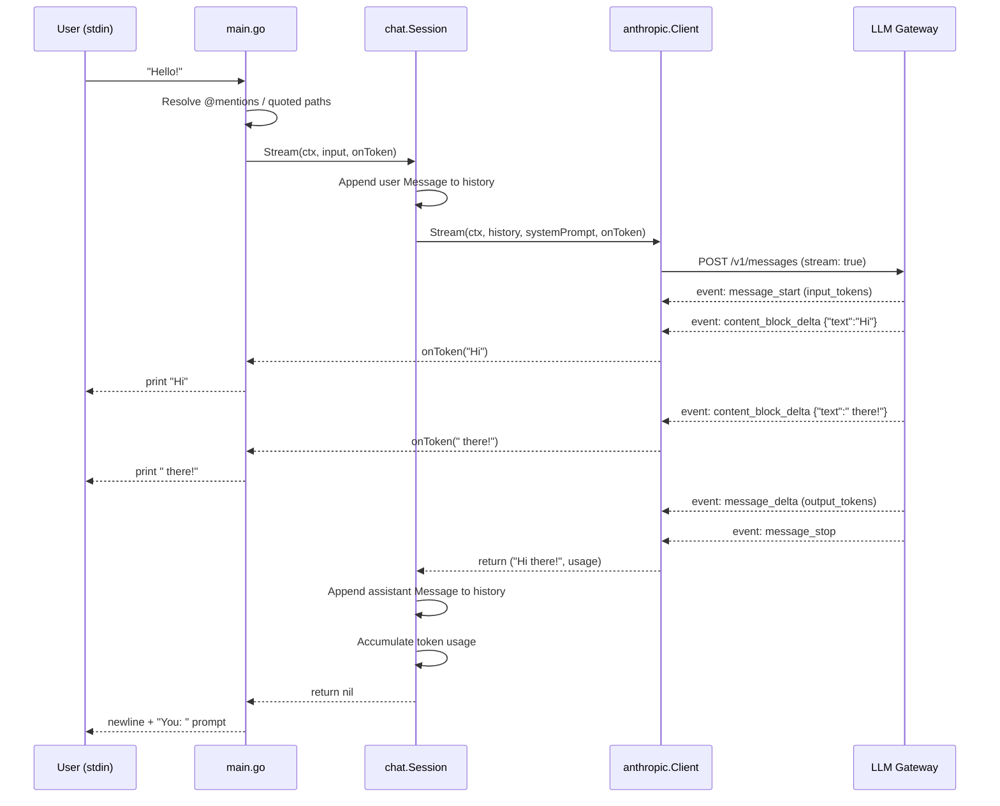

# LLM Terminal Chat Client

A **minimal, zero-boilerplate** Go terminal chat client for any **Anthropic-compatible LLM gateway**.
Ships with a built-in conversation loop, **real-time streaming**, and **image (vision) support**.

---

## Features

- 🔐 Credential-free source code — secrets live only in `.env`
- 🧠 Full conversation memory — history is sent on every request
- ⚡ **Streaming responses** — tokens print as they arrive (no long silences)
- 🖼️ **Image support** — send local images (JPEG, PNG, GIF, WebP) with `/image`
- 📎 **File injection** — `@filename`, `/file`, drag-and-drop quoted paths
- 🛑 **Graceful shutdown** — Ctrl+C cancels in-flight requests cleanly
- 🛠️ Slash commands: `/file`, `/image`, `/dir`, `/cd`, `/reset`, `/history`, `/usage`, `/help`, `/quit`
- ⚙️ All config overridable via environment variables
- ✅ **Tested** — unit tests with mock SSE server for streaming, file injection, path resolution

---

## Project Structure

```
LLM-from-api/
├── .env                        # ← your secrets (git-ignored)
├── .env.example                # ← safe-to-commit template
├── .gitignore
├── .claude/                    # Claude Code project config
│   ├── CLAUDE.md               # AI pair-programming guide
│   └── commands/               # custom slash commands (/test, /build, /lint, etc.)
├── go.mod / go.sum
├── main.go                     # REPL entry point + slash commands + UI
├── README.md
└── internal/
    ├── anthropic/
    │   ├── client.go           # SSE streaming client (auth, JSON, image blocks)
    │   └── client_test.go      # mock SSE server tests
    ├── chat/
    │   └── session.go          # conversation-history manager
    └── fileutil/
        ├── fileutil.go         # path resolution, @mention injection, dir listing
        └── fileutil_test.go    # path, injection, and formatting tests
```

---

## Quick Start

### 1. Configure environment

```bash
cp .env.example .env
# Edit .env and fill in your real values
```

`.env` keys:

| Variable | Description |
|---|---|
| `ANTHROPIC_BASE_URL` | Gateway base URL |
| `ANTHROPIC_AUTH_TOKEN` | API key / auth token |
| `ANTHROPIC_DEFAULT_SONNET_MODEL` | Default model name |
| `LLM_MODEL` | *(optional)* Override model at runtime |

### 2. Run

```bash
go run .
```

### 3. Build a standalone binary

```bash
go build -o llm-chat .
./llm-chat
```

### 4. Override a single variable without editing .env

```bash
LLM_MODEL=other-model go run .
```

### 5. Run tests

```bash
go test ./... -v
```

---

## Chat Commands

| Command | Effect |
|---|---|
| `@filename` | Attach a file inline (e.g. `@main.go explain this code`) |
| `/file <path> [question]` | Attach a file with an optional question |
| `/image <path> [caption]` | Send a local image file (with optional text) to the model |
| `/dir [path]` | List files in working directory (or given path) |
| `/cd <path>` | Change working directory |
| `/reset` | Clear conversation history |
| `/history` | Print all turns so far |
| `/usage` | Show token usage for this session |
| `/help` | Show command list |
| `/quit` or `Ctrl+D` | Exit |

### File injection examples

```
You: @main.go explain the REPL loop
You: /file internal/anthropic/client.go what does Stream() do?
You: '/Users/me/Desktop/data.json' parse this
```

### Image example

```
You: /image ~/Desktop/chart.png What trend do you see in this chart?
```

Supported formats: **JPEG, PNG, GIF, WebP**

> **Note:** Vision support depends on the gateway. If the model or gateway doesn't support images, you'll get a clear API error message.

---

## Architecture

### Package Dependency



### REPL Flow



### SSE Streaming Detail



---

## Dependencies

| Package | Version | Purpose |
|---|---|---|
| `github.com/joho/godotenv` | v1.5.1 | Load `.env` file at startup |

All other logic uses Go stdlib only (`net/http`, `encoding/json`, `bufio`, `os`, `context`).

---

## Extending

- **REST API mode** — wrap `chat.Session` in a `net/http` handler or Gin router.
- **Multiple sessions** — store sessions in a `map[string]*chat.Session` keyed by session ID.
- **Persist history** — serialize `session.History()` to JSON after each turn.
- **Model switching** — add `/model <name>` slash command, store active model on `Session`.
